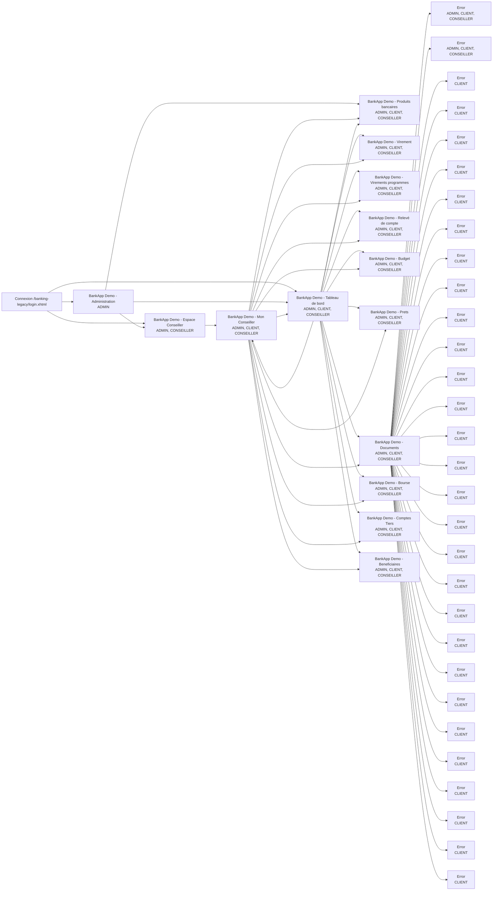

# Graphe de navigation

```mermaid
flowchart LR
    banking_legacy_admin_xhtml["BankApp Demo - Administration<br/>ADMIN"]
    banking_legacy_conseiller_workspace_xhtm["BankApp Demo - Espace Conseiller<br/>ADMIN, CONSEILLER"]
    banking_legacy_dashboard_xhtml["BankApp Demo - Tableau de bord<br/>ADMIN, CLIENT, CONSEILLER"]
    banking_legacy_produits_xhtml["BankApp Demo - Produits bancaires<br/>ADMIN, CLIENT, CONSEILLER"]
    banking_legacy_conseiller_xhtml["BankApp Demo - Mon Conseiller<br/>ADMIN, CLIENT, CONSEILLER"]
    banking_legacy_virement_xhtml["BankApp Demo - Virement<br/>ADMIN, CLIENT, CONSEILLER"]
    banking_legacy_virement_programme_xhtml["BankApp Demo - Virements programmes<br/>ADMIN, CLIENT, CONSEILLER"]
    banking_legacy_releve_xhtml["BankApp Demo - Relevé de compte<br/>ADMIN, CLIENT, CONSEILLER"]
    banking_legacy_budget_xhtml["BankApp Demo - Budget<br/>ADMIN, CLIENT, CONSEILLER"]
    banking_legacy_pret_xhtml["BankApp Demo - Prets<br/>ADMIN, CLIENT, CONSEILLER"]
    banking_legacy_documents_xhtml["BankApp Demo - Documents<br/>ADMIN, CLIENT, CONSEILLER"]
    banking_legacy_bourse_xhtml["BankApp Demo - Bourse<br/>ADMIN, CLIENT, CONSEILLER"]
    banking_legacy_comptes_tiers_xhtml["BankApp Demo - Comptes Tiers<br/>ADMIN, CLIENT, CONSEILLER"]
    banking_legacy_beneficiaires_xhtml["BankApp Demo - Beneficiaires<br/>ADMIN, CLIENT, CONSEILLER"]
    docs_download["Error<br/>ADMIN, CLIENT, CONSEILLER"]
    docs_download_2["Error<br/>ADMIN, CLIENT, CONSEILLER"]
    docs_download_3["Error<br/>CLIENT"]
    docs_download_4["Error<br/>CLIENT"]
    docs_download_5["Error<br/>CLIENT"]
    docs_download_6["Error<br/>CLIENT"]
    docs_download_7["Error<br/>CLIENT"]
    docs_download_8["Error<br/>CLIENT"]
    docs_download_9["Error<br/>CLIENT"]
    docs_download_10["Error<br/>CLIENT"]
    docs_download_11["Error<br/>CLIENT"]
    docs_download_12["Error<br/>CLIENT"]
    docs_download_13["Error<br/>CLIENT"]
    docs_download_14["Error<br/>CLIENT"]
    docs_download_15["Error<br/>CLIENT"]
    docs_download_16["Error<br/>CLIENT"]
    docs_download_17["Error<br/>CLIENT"]
    docs_download_18["Error<br/>CLIENT"]
    docs_download_19["Error<br/>CLIENT"]
    docs_download_20["Error<br/>CLIENT"]
    docs_download_21["Error<br/>CLIENT"]
    docs_download_22["Error<br/>CLIENT"]
    docs_download_23["Error<br/>CLIENT"]
    docs_download_24["Error<br/>CLIENT"]
    docs_download_25["Error<br/>CLIENT"]
    docs_download_26["Error<br/>CLIENT"]
    docs_download_27["Error<br/>CLIENT"]
    docs_download_28["Error<br/>CLIENT"]
    docs_download_29["Error<br/>CLIENT"]
    docs_download_30["Error<br/>CLIENT"]
    login["Connexion /banking-legacy/login.xhtml"]

    login --> banking_legacy_admin_xhtml
    login --> banking_legacy_conseiller_workspace_xhtm
    login --> banking_legacy_dashboard_xhtml
    banking_legacy_admin_xhtml --> banking_legacy_conseiller_workspace_xhtm
    banking_legacy_admin_xhtml --> banking_legacy_dashboard_xhtml
    banking_legacy_admin_xhtml --> banking_legacy_produits_xhtml
    banking_legacy_conseiller_workspace_xhtm --> banking_legacy_conseiller_xhtml
    banking_legacy_dashboard_xhtml --> banking_legacy_virement_xhtml
    banking_legacy_dashboard_xhtml --> banking_legacy_virement_programme_xhtml
    banking_legacy_dashboard_xhtml --> banking_legacy_releve_xhtml
    banking_legacy_dashboard_xhtml --> banking_legacy_budget_xhtml
    banking_legacy_dashboard_xhtml --> banking_legacy_pret_xhtml
    banking_legacy_dashboard_xhtml --> banking_legacy_documents_xhtml
    banking_legacy_dashboard_xhtml --> banking_legacy_bourse_xhtml
    banking_legacy_dashboard_xhtml --> banking_legacy_comptes_tiers_xhtml
    banking_legacy_dashboard_xhtml --> banking_legacy_beneficiaires_xhtml
    banking_legacy_documents_xhtml --> docs_download
    banking_legacy_documents_xhtml --> docs_download_2
    banking_legacy_conseiller_xhtml --> banking_legacy_dashboard_xhtml
    banking_legacy_conseiller_xhtml --> banking_legacy_virement_xhtml
    banking_legacy_conseiller_xhtml --> banking_legacy_virement_programme_xhtml
    banking_legacy_conseiller_xhtml --> banking_legacy_releve_xhtml
    banking_legacy_conseiller_xhtml --> banking_legacy_budget_xhtml
    banking_legacy_conseiller_xhtml --> banking_legacy_pret_xhtml
    banking_legacy_conseiller_xhtml --> banking_legacy_documents_xhtml
    banking_legacy_conseiller_xhtml --> banking_legacy_bourse_xhtml
    banking_legacy_conseiller_xhtml --> banking_legacy_produits_xhtml
    banking_legacy_conseiller_xhtml --> banking_legacy_comptes_tiers_xhtml
    banking_legacy_conseiller_xhtml --> banking_legacy_beneficiaires_xhtml
    banking_legacy_dashboard_xhtml --> banking_legacy_conseiller_xhtml
    banking_legacy_dashboard_xhtml --> banking_legacy_produits_xhtml
    banking_legacy_documents_xhtml --> docs_download_3
    banking_legacy_documents_xhtml --> docs_download_4
    banking_legacy_documents_xhtml --> docs_download_5
    banking_legacy_documents_xhtml --> docs_download_6
    banking_legacy_documents_xhtml --> docs_download_7
    banking_legacy_documents_xhtml --> docs_download_8
    banking_legacy_documents_xhtml --> docs_download_9
    banking_legacy_documents_xhtml --> docs_download_10
    banking_legacy_documents_xhtml --> docs_download_11
    banking_legacy_documents_xhtml --> docs_download_12
    banking_legacy_documents_xhtml --> docs_download_13
    banking_legacy_documents_xhtml --> docs_download_14
    banking_legacy_documents_xhtml --> docs_download_15
    banking_legacy_documents_xhtml --> docs_download_16
    banking_legacy_documents_xhtml --> docs_download_17
    banking_legacy_documents_xhtml --> docs_download_18
    banking_legacy_documents_xhtml --> docs_download_19
    banking_legacy_documents_xhtml --> docs_download_20
    banking_legacy_documents_xhtml --> docs_download_21
    banking_legacy_documents_xhtml --> docs_download_22
    banking_legacy_documents_xhtml --> docs_download_23
    banking_legacy_documents_xhtml --> docs_download_24
    banking_legacy_documents_xhtml --> docs_download_25
    banking_legacy_documents_xhtml --> docs_download_26
    banking_legacy_documents_xhtml --> docs_download_27
    banking_legacy_documents_xhtml --> docs_download_28
    banking_legacy_documents_xhtml --> docs_download_29
    banking_legacy_documents_xhtml --> docs_download_30
```
